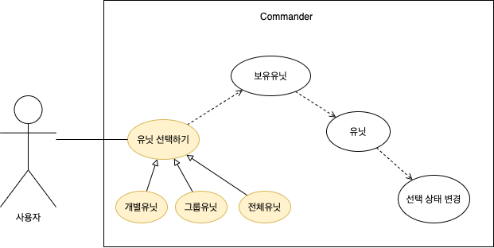

# SelectUnit
## 요구사항
- 커맨더가 유닛을 한 마리씩 선택할 수 있어야함
- 커맨더가 같은 종류의 유닛을 모두 선택할 수 있어야함
- 커맨더가 모든 유닛을 선택할 수 있어야함

## 분석
- 선택시 조건은 1. 한 마리, 2. 같은 종류, 3. 모든 유닛
- 유닛 선택기능에서 커맨더가 보유한 유닛의 선택 상태가 변경되어야 하는 부분은 공통
- 커맨더는 유닛이 스스로 선택된 상태를 변경하는 메서드를 호출해야함
### 필요한 것
- 커맨더 객체
- 유닛 객체

## 유스케이스 다이어그램
